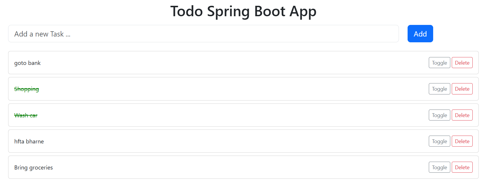
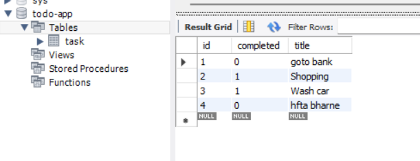

# 📝 Todo List Web Application

A simple and clean Todo List web app built using **Spring Boot**, **Thymeleaf**, **Bootstrap**, and **MySQL**. It helps users manage their daily tasks by allowing them to add, update, and delete todos efficiently.

---

## 🚀 Features

- Add new todos   
- Mark todos as complete/incomplete  
- Delete todos  
- Responsive UI using Bootstrap  
- Persistent storage with MySQL  

---

## 🖼️ Screenshots

<div align="center">
  
  
</div>

<div align="center">
  <b>🖥️ Todo App UI</b> &nbsp;&nbsp;&nbsp;&nbsp;&nbsp;&nbsp;&nbsp;&nbsp; <b>🗄️ MySQL Database Table</b>
</div>

---

## 🛠️ Tech Stack

- Java  
- Spring Boot  
- Thymeleaf  
- Bootstrap 5  
- MySQL  
- HTML & CSS  

---

## ⚙️ How to Run Locally

1. **Clone the repository**
   ```bash
   git clone https://github.com/raj121276thakre/Todo-Spring-Boot-App.git
   cd Todo-Spring-Boot-App
   ```

2. **Configure MySQL in `application.properties`:**
   ```properties
   spring.datasource.url=jdbc:mysql://localhost:3306/tododb
   spring.datasource.username=root
   spring.datasource.password=yourpassword
   spring.jpa.hibernate.ddl-auto=update
   spring.jpa.properties.hibernate.dialect=org.hibernate.dialect.MySQLDialect
   ```

3. **Create the database in MySQL**
   ```sql
   CREATE DATABASE tododb;
   ```

4. **Run the application**
   ```bash
   ./mvnw spring-boot:run
   ```

5. **Visit in browser**
   ```
   http://localhost:8080
   ```

---

## 📂 Project Structure

```
src/
├── main/
│   ├── java/
│   │   └── com.example.todo/       # Java source files
│   ├── resources/
│   │   ├── templates/              # Thymeleaf HTML templates
│   │   └── application.properties  # Spring Boot config
└── test/                           # Unit tests
```

---

## 🤝 Contributing

Feel free to fork this project and submit pull requests. For major changes, please open an issue first to discuss what you'd like to improve.

---

## 📬 Contact

**Raj Thakre**  
📧 raj121276thakre@gmail.com  
🔗 [GitHub](https://github.com/raj121276thakre) | [LinkedIn](https://linkedin.com/in/raj-thakre-3615a9222)

---

⭐ If you like this project, don't forget to **star it**!
